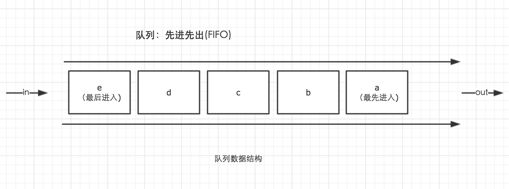

1.**看下面代码，给出输出结果。**

```javascript
for(var i=1;i<=3;i++){
  setTimeout(function(){
  console.log(i);    
  },0);
  console.log('123');
};


//答案：4 4 4。
```

setTimeout有两个参数，第一个参数为一个函数，我们通过该函数定义将要执行的操作。第二个参数为一个时间毫秒数，表示延迟执行的时间。

页面中所有由setTimeout定义的操作，都将放在同一个队列中依次执行。**而这个队列执行的时间，需要等待到函数调用栈清空之后才开始执行。**即所有可执行代码执行完毕之后，才会开始执行由setTimeout定义的操作。而这些操作进入队列的顺序，则由设定的延迟时间来决定。



**最简单的理解方式：调用setTimeout时，把函数参数，放到事件队列中。等主程序运行完，再调用。**


原因：Javascript事件处理器在线程空闲之前不会运行。


1.2 **追问，如何让上述代码输出1 2 3**

据setTimeout定义的操作在函数调用栈清空之后才会执行的特点，for循环里定义了3个setTimeout操作。而当这些操作开始执行时，for循环的i值，已经先一步变成了4。因此输出结果总为4。而我们想要让输出结果依次执行，我们就必须借助闭包的特性，每次循环时，将i值保存在一个闭包中，当setTimeout中定义的操作执行时，则访问对应闭包保存的i值即可。

在函数中闭包判定的准则，即执行时是否在内部定义的函数中访问了上层作用域的变量。因此我们需要包裹一层自执行函数为闭包的形成提供条件。

因此，我们只需要2个操作就可以完成题目需求，一是使用自执行函数提供闭包条件，二是传入i值并保存在闭包中。

```javascript
for(var i=1;i<=3;i++){
  setTimeout((function(a){  //改成立即执行函数
    console.log(a);    
  })(i),0);  
};


for(var i=1;i<=3;i++){
  (function (i) {
    setTimeout(function(){  //改成立即执行函数
      console.log(i) 
    },0)  
  })(i)
}

//输出：1 2 3
```


2.**写一个function，清除字符串前后的空格。（兼容所有浏览器）**

需求：创建一个函数

功能：清除字符串的前后空格

要求：兼容所有浏览器


**trim() **方法会从一个字符串的两端删除空白字符。在这个上下文中的空白字符是所有的空白字符 (space, tab, no-break space[^nbsp注释] 等) 以及所有行终止符字符（如 LF[^lf注释]，CR[^cr注释]）。


**语法**

```javascript
str.trim()
```

**描述**

`trim() 方法`并不影响原字符串本身，它返回的是一个新的字符串。

**例子**

使用 `trim()`

下面的例子中将显示小写的字符串 'foo':

```javascript
var orig = '   foo  ';
console.log(orig.trim()); // 'foo'

// 另一个.trim()例子，只从一边删除

var orig = 'foo    ';
console.log(orig.trim()); // 'foo'
```

**浏览器兼容性**

|    Feature    |              Firefox(Gecko)              | Chrome | Internet Explorer | Opera | Safari |
| :-----------: | :--------------------------------------: | :----: | :---------------: | :---: | :----: |
| Basic support | [3.5](https://developer.mozilla.org/en-US/Firefox/Releases/3.5) (1.9.1) | (Yes)  |         9         | 10.5  |   5    |


```javascript
//我的
if (!String.prototype.trim) { 
  String.prototype.trim = function() { 
    // return this.replace(/^\s+/, "").replace(/\s+$/,"");
    return this.replace(/^\s+|\s+$/g, '')
  } 
} 
// test the function 
var str = " \t\n\r test string ".trim(); 
alert(str === "test string"); // alerts "true"
```


**兼容旧环境**

如果 `trim()`不存在，可以在所有代码前执行下面代码

```javascript
if (!String.prototype.trim) {
  String.prototype.trim = function () {
    return this.replace(/^[\s\uFEFF\xA0]+|[\s\uFEFF\xA0]+$/g, '');
  };
}
```


[^tab注释]: HT，水平制表，跳到下一个TAB位置， \t,ASCII码为9
[^nbsp注释]: no-break space 不换行的空格在 HTML 中，与普通空格字符宽度相同的普通不间断空格被编码为`&nbsp;`或`&#160;`
[^lf注释]: LF意思是 linefeed ，换行，将当前位置移到下一行开头，\n，ASCII 码为10
[^cr注释]: CR意思是 carriage return ，回车，将当前位置移到本行开头，\r，ASCII 码为13 

[wikipedia—Non-breaking space](https://en.wikipedia.org/wiki/Non-breaking_space)

[MDN—trim()](https://developer.mozilla.org/zh-CN/docs/Web/JavaScript/Reference/Global_Objects/String/Trim)


**数组去重**

```javascript
var arr = ['aaa','bbb','aaa','ccc','111','bbb','ddd','ccc','222','ccc','111','fff'];
//定义一个新的数组
var s = [];
//遍历数组
for(var i = 0;i<arr.length;i+ +){
    if(s.indexOf(arr[i]) == -1){  //判断在s数组中是否存在，不存在则push到s数组中
        s.push(arr[i]);
    }
}
console.log(s); //["aaa", "bbb", "ccc", "111", "ddd", "222", "fff"]
```

**关于indexOf()方法：**

indexOf() 方法可返回某个指定的字符串值在字符串中首次出现的位置。

**如果在数组中没找到字符串则返回 -1。** 